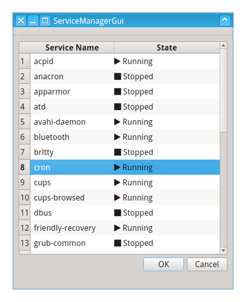

# ServiceManagerGui

An easy service manager for Ubuntu **under development**

## Features

* List processes and process state (ie Running, Stopped)

## TODO

* Stop or Start process on selection
* Auto refresh